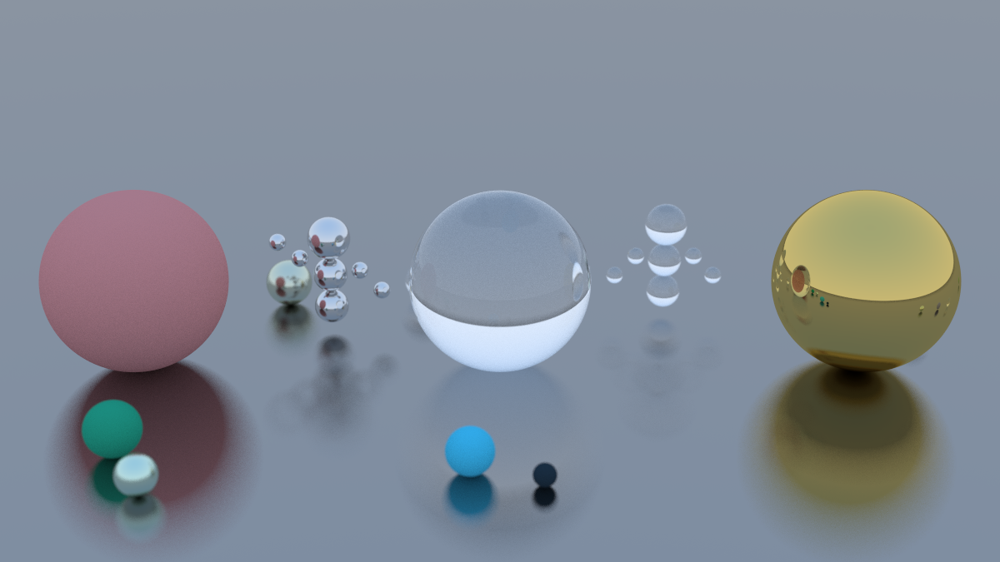

# Prova 2 — Processamento Gráfico

Este projeto foi desenvolvido como parte da disciplina de Processamento Gráfico, com o objetivo de explorar os conceitos básicos do Ray Tracing na prática. A proposta envolve o estudo do material "Ray Tracing in One Weekend" e o desenvolvimento de uma cena com esferas de diferentes materiais, além de modificações nas localizações, parâmetros dos materiais e configurações da câmera para gerar uma imagem estética e personalizada.

## Integrantes do Grupo

| Nome                                   | RA     |
|----------------------------------------|--------|
| Caio Monteiro Arraes                   | 822659 |
| Gabriel Henrique Urbano                | 824031 |
| Guilherme Saggion Moraes               | 823159 |
| Matheus Ruy Bernardo                   | 824365 |
| Thales Leonardo Euler Vieira de Sousa  | 822881 |

---

## Nossa Cena

A cena final representa uma espécie de museu ou galeria de arte. As três esferas maiores simbolizam **estátuas centrais**, representando obras de destaque. Em torno delas, posicionamos dois grupos com três esferas menores empilhadas, que fazem referência a **pessoas observando** as estátuas, como se fossem visitantes.

Comparando com o código original do repositório, mantivemos os três materiais principais (difuso, metálico e dielétrico), mas **reposicionamos os objetos** e alteramos suas dimensões para criar uma composição visual mais clara e simbólica. A câmera também foi ajustada para fornecer uma perspectiva um pouco mais afastada porém centralizada, dando uma impressão panorâmica do museu.



---

## Execução

Utiliza-se **CMake** para compilar e rodar o projeto.

### No Linux:

```bash
cmake -B build/Release -DCMAKE_BUILD_TYPE=Release
cmake --build build/Release
./build/Release/inOneWeekend > imagem.ppm
```

# Se seu sistema não conseguir abrir imagem.ppm diretamente, você pode utilizar um visualizador de imagens como o ImageMagick:

```bash
sudo apt install imagemagick
display imagem.ppm
```

# Você pode também converter a imagem no formato .ppm para .png

```bash
convert imagem.ppm imagem.png
```

### No Windows:
É possível compilar com CMake utilizando o Visual Studio ou o terminal Developer Command Prompt for VS. Após compilar, o executável também pode ser redirecionado para gerar a imagem:

```powershell
inOneWeekend.exe > imagem.ppm
```

Caso o Windows não abra .ppm nativamente, recomenda-se abrir a imagem com softwares como GIMP, IrfanView, ou converter para .png com ImageMagick (se instalado via WSL ou ambiente compatível).